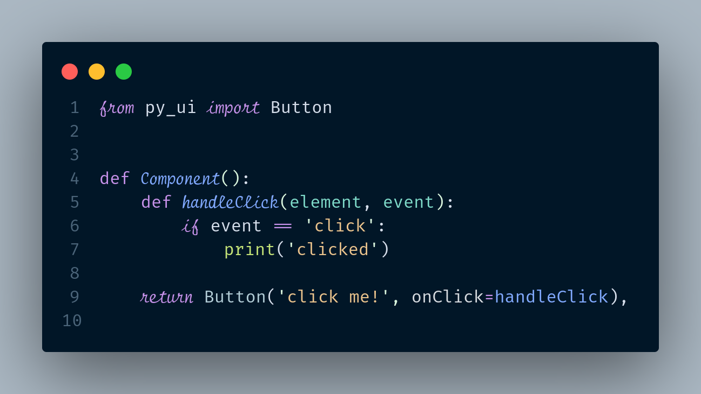

# Py UI
A python web framework inspired by react native

## Why?

Well I come from a web background, and I like some stuff so much there that it hurts a little I can't have the same experience this side of python, I think we should be able to reproduce the great web dx and laziness of doing things in a python world from a web dev perspective, that's the number one purpose of this attempt, write python, build like react and the rest of the web space, python web doesn't have to suck and not be main stream if possible!

## Building On Giants

This project is heavily inspired by react native, reflex and for now hopes to use flask for server redering and handling server routing, pydiode (wasm) to run python code in broswer (this is to be mostly for the computational parts) and then some custom stuff for rendering and state and other things.

See the images, something might click your brain button:

and overall concept:
.png)

## Links

-  [Pydiode](https://pyodide.org/en/stable/usage/quickstart.html)
-  [React Native](https://reactnative.dev/)
-  [Reflex](https://reflex.dev/docs/getting-started/introduction/)

## Todo

- Rendering
- Event Loop
- State Management
- Routing
- Components
- Animations
- Styling
- Layouts
- Accessibility
- Testing
- Performance
- Documentation
- Examples

## Credits

Hussein Kizz, I really have no idea what am getting myself into, just stubborn, I need guidance, thanks, am at hssnkizz@gmail.com

## License